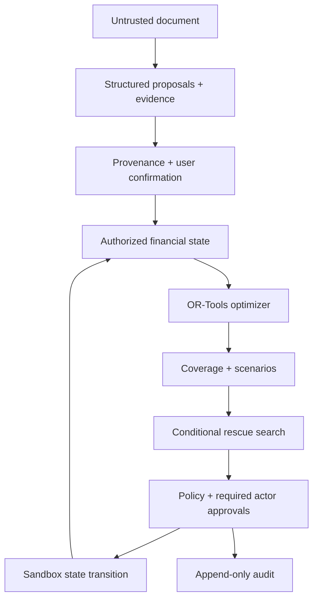

# Architecture and financial invariants

LATTICE has separate understanding, planning, authorization and execution boundaries. The current provider is a deterministic parser of labelled text, not a live language model. It receives strings/blocks and returns Pydantic proposals; it receives no database session, tool registry, credential or action capability.

## Domain and persistence

The initial sixteen SQLAlchemy tables cover Actor, AuthSession, Permission, Document, DocumentBlock, FinancialFact, FundingSource, Obligation, TransferRoute, Plan, PlanAllocation, ScenarioRun, ScenarioResult, InterventionCandidate, PreparedAction and AuditEvent. The frozen initial Alembic revision explicitly creates the schema and audit UPDATE/DELETE guards. Migration drift is checked against the model on fresh PostgreSQL.

Each plan stores a version, immutable-style input snapshot and canonical SHA-256 state hash. Financial changes invalidate current plans and prepared approvals, generate a replacement when a prior plan exists, and rerun a 100-iteration comparison. A detailed user-requested scenario defaults to 1,000 iterations. Beneficiary changes and permission changes also invalidate dependent state.

The graph API derives actor ownership nodes, funding nodes, obligation nodes and allocation edges from the same authorized state and plan. Allocation inspector data contains source/destination amount, route, schedule, arrival, verification and risk. Transfer routes are edge attributes rather than extra account nodes.

## Monetary model

Supported currencies are centralized in `lattice_core/currencies.py`: EUR, USD, CNY, VND, GBP, JPY, KRW, SGD, HKD, AUD, CAD, CHF and THB. VND/JPY/KRW use one major unit per monetary unit; the others use 100 minor units. API/extraction precision validation, optimization, simulation and public `/currencies` metadata use the same registry. Input validates precision rather than silently rounding user money. Demo route seeding preserves the original four routes and fills every missing ordered pair, including same-currency routes: 169 pairs and 170 route records. Existing demo databases are backfilled idempotently at startup and changed quotes invalidate old plan snapshots/actions. No user balance is reset by this backfill.

The optimizer uses integer minor units. To bound integer coefficients, the effective destination-minor/source-minor FX ratio is rounded downward to six decimal places. For a requested destination amount `d`, source principal is the smallest integer `p` satisfying `d <= p*r`, equivalently `p = ceil(d/r)`. This permits an exact whole-unit VND/JPY/KRW destination when source cents cannot reproduce that exact number under a floor-only conversion. Fixed and percentage fees round up in source units. Unused conversion residue, including conservative rate precision, is disclosed as `estimated_rounding_cost_eur`, included in the total cost; it is never credited as invented destination money. The route maximum, budget and protected reserve include the resulting source principal and fees as applicable.

For source `j`, route `k`, obligation `i`, principal `p`, route-use binary `y`, fee `f`, destination `d`:

- `p >= max(1, ceil(route_min * source_scale)) * y`.
- `p <= floor(route_max * source_scale) * y`.
- `f = ceil(p * percentage_fee) + ceil(fixed_fee * source_scale) * y`.
- For a used route with conservatively quantized minor-unit FX ratio `r`, `(p - 1) * r < d <= p * r`, equivalently `p = ceil(d / r)`. The requested destination is fixed; residual conversion value is disclosed rather than credited.
- Sum of principal and fees from a source is at most its balance minus protected minimum.
- Sum of destination amounts for an obligation plus nonnegative shortfall equals its amount; no overpayment is possible.
- Candidate arcs exist only for matching currencies, verified available routes, verified commitments with verified beneficiaries (or explicit budget-only reserves) and no security hold, usable funding, ownership permission and compatible source restrictions.
- `max(as_of, available_from) + settlement_p95_days <= obligation_due_date` for every emitted allocation.
- Emergency sources are excluded until an explicitly approved reserve-release intervention changes their state.

Lexicographic solves minimize uncovered value, then uncertain allocation value at each priority (CRITICAL, HIGH, NORMAL, OPTIONAL), followed by near-deadline timing exposure and base-EUR source expenditure. Thus financial cost never outweighs a feasible critical commitment. A time-limited feasible solve is labelled FEASIBLE, not OPTIMAL. If no validated solver result exists, the result contains no allocations and an error. A separate post-solve validator rechecks trust, authorization, budget, reserve, currency, timing, route bounds, fees and destination conservation.

Fixed demo EUR valuations for all 13 currencies are recorded in the currency registry and exposed as public metadata. They support objective comparability and UI aggregates; they are not live FX quotes. Reported route cost includes explicit fees, quoted FX markup loss and conservative rounding residue. These valuations can differ from an individual route's quote.

Insufficient funding returns a gap-bearing plan, not a false certificate of feasibility. Partial allocations can describe coverage even if partial payment is not allowed; the action layer refuses payment until the obligation has full on-time verified coverage. Installments are explicit changed obligations after simulated institution consent.

## Coverage and liquidity

For obligation amount `A`:

- **Nominal:** all planned destination amounts / A, capped at 1; expected/conditional funds can contribute to forecast allocations.
- **Verified:** only confirmed/source-verified funding whose status is AVAILABLE or PLANNED, with necessary authority.
- **On-Time Verified:** verified destination amounts whose arrival is on or before the deadline / A.

A confirmed scholarship notice does not prove receipt: its source remains EXPECTED and does not increase verified coverage. A manually attested received balance can be AVAILABLE, with an explicit confirmation note. PLANNED parent contributions are conditional on the funding owner's authorization and quoted settlement, and payment execution still requires that owner's approval.

The original optimizer returns per-currency residual liquid money, now labelled “Unallocated in this plan”. Life Safe-to-Spend adds a conservative 365-day verified-commitment and active-allocation guard, described below. Both exclude expected or parent-owned money from disposable liquidity.

Financial amounts are summed with Decimal before coverage ratios are serialized. The Overview aggregates coverage by demo-EUR value, not by adding unrelated currency units. SAFE means critical obligations inside the stated horizon are verified and on time; it does not certify later debts or eliminate stochastic risk.

## Scenarios and rescue

NumPy uses a fixed seed and sampled delays/FX/expense magnitudes bounded by controls. It changes arrival times, conversion receipts and selected cancellations, then recalculates coverage of the existing allocations. Scenario Failure Rate includes any existing verified gap. Forecast Failure Rate separately assumes expected income arrives. The before/after chart applies the maximum selected shocks; distribution metrics use all sampled iterations.

Rescue enumerates applicable reallocation, installment, reserve-release, optional deferral, deadline extension and expedited-dispatch variants. Each variant searches the minimum additional family contribution to one EUR cent using the optimizer. A pure unchanged-state funding increase is named INCREASE_FAMILY_TRANSFER. All installment principal, deferred debts and institution fees remain represented. Extensions keep critical debt inside the horizon.

Score = institution fees + family contribution × 0.08 + released reserve × 0.15 + friction × 10 by default. Weights are environment-configurable. Scenario failure, people involved and assumptions are displayed separately. It is the minimum among evaluated bundles, not an unrestricted global optimization over every possible combination. Additional family money is a disclosed hypothetical EUR receipt and is never silently made real.

## Policy and execution

P0 view and P1 analysis are API-authorized by role/resource. PreparedAction starts at P2. Payment preparation freezes beneficiary, obligation version, allocations, required source owners and current state hash. P3 execution requires every approval, a matching state hash, no security hold and preserved reserves. Execution changes simulated balances/status, generates a sandbox receipt and replans. An executed action cannot execute twice. P4 real-money execution is absent.

APPROVE_OWN_FUNDS controls planning authorization, not substitution for execution consent. APPROVE_ACTION adds an approver and clears previous approvals; it never removes required owners. Revocation removes only the delegated approver and requires fresh base approvals. APPROVE_PLAN permits activation without granting private plan data. Parent action responses expose only their contribution and approval status.

PostgreSQL advisory transaction locking occurs before mutation reads and serializes financial changes across workers. The single-process ASGI write guard also serializes demo mutations. The local portable database uses a one-connection pool; no high-concurrency performance claim is made.

## Interface localization

A React locale provider drives English, Vietnamese and Simplified Chinese labels and Intl currency/date formatting. The selected locale is saved in local browser storage. Dictionary templates preserve dynamic counts/amounts and submitted API enums remain canonical English/ISO codes. Financial source text, evidence, account identifiers, audit payloads and exported benchmarks are not translated. Noto Sans SC is self-hosted through a pinned package; no runtime font/CDN request is required. Locale changes do not alter permissions, verification states or financial amounts.

## Life Event Layer (2026-09-25)

`0002_life_events` adds a seventeenth table, LifeEvent, and `Obligation.budget_only`. LifeEvent stores private ownership, integer minor-unit amounts/ranges, dates/windows, raw input, structured interpretation, review state, provenance notes, links and optimistic versions. `lattice_core/life/schemas.py` rejects unknown fields, unsupported currencies, fractional minor units and malformed ranges. The provider receives only text, locale and the demo clock. Its schema cannot carry approval, verification status, actor ownership, allocations or execution commands.

`lattice_ai/life/interpretation.py` implements bounded deterministic EN/VI/ZH phrase recognition. `effects.py` transforms copies, `budget.py` calculates conservative capacities and recorded-commitment runway, `analysis.py` compares scenarios, `service.py` owns ledger transactions, and `inbox.py` derives reminders. `apps/api/routes_life.py` enforces student scope before resolving IDs.

A captured or hypothetical event changes only the event table and audit history. Simulation persists a comparison, never a financial mutation. Real-event confirmation requires an explicit note, correct links and required critical details. It invalidates prior actions/plans and includes the pending event in the budget. Apply requires that exact event version and unchanged financial-state hash, debits only eligible owned money, creates any associated receivable/debt atomically, then generates a plan and seeded scenario. Replays and stale confirmations fail closed. Expected funding remains EXPECTED until a separate receipt attestation; the resulting verification is USER_CONFIRMED, never SOURCE_VERIFIED.

Living-cost commitments can have a verified amount and date without a bank beneficiary. Their `budget_only` flag allows the optimizer and independent validator to reserve funds. Payment policy always blocks such an obligation; the flag does not fabricate an account or permit a transfer. Emergency costs are CRITICAL, essential costs cannot be downgraded below HIGH. Recurrences materialize budget obligations through an inclusive 365-day window, so persisted PlanAllocation foreign keys always point to real obligations. There is no automatic infinite recurrence worker.

Reported parent delays and temporary unavailability are conservative projections in the student's financial state, not edits to another actor's bank balance. Active reports delay availability, lower a planning assumption or lock a source. Resolving a report removes that projection but cannot credit money or restore an already-recorded expense. Parent API views never include the private reports.

The Life Safe-to-Spend engine runs verified-only optimization over 365 days. It preserves the larger per-source requirement of the computed plan and an active plan, then protects minimums/reserves. If any critical or high-priority obligation still lacks verified timely funding, spend capacity is zero. Otherwise only residual AVAILABLE, verified, unrestricted student money is considered; a valid route must cover source fees, route bounds and p95 arrival by the spending date. Future capacities assume the recorded state remains available; they do not assume expected receipts. This is a conservative limit, not a global proof of maximal discretionary spending. The older selected-plan residual metric is now labelled “Unallocated in this plan”.

Shared bills debit the full bill and create an independent receivable event; borrowing creates both liquidity and repayment debt in one transaction. Travel is a shadow envelope with eight editable categories, each using a supported currency. Missing estimates remain unknown. Ranges evaluate low/mid/high amounts and declared date-window endpoints; “expected case” means midpoint, not a measured statistical expectation. Runway identifies the first gap in recorded essential commitments, with a separate conditional forecast including expected funds and an explicit incomplete-living-cost warning.

An actual expense can explicitly settle an owned open `budget_only` commitment only when its full amount and currency match. Debit and PAID status are atomic, preventing double counting in future budgets. The same shortcut is forbidden for ordinary payment obligations, which retain the existing prepared-action approval boundary.
